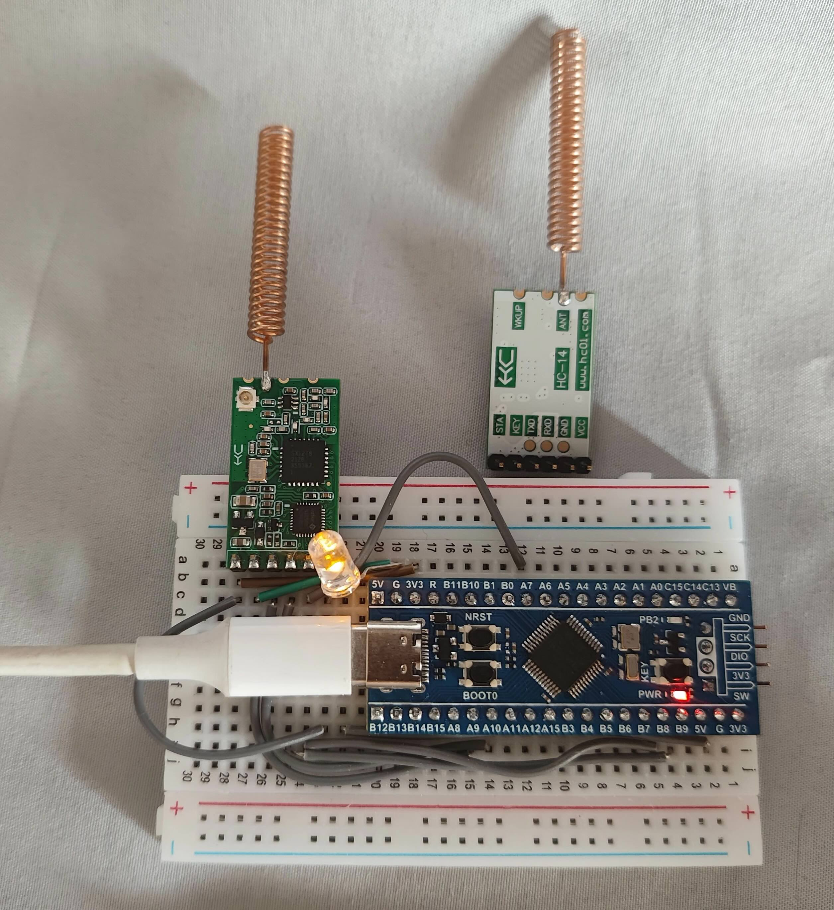

# hc14-at-rs driver

![No Std][no-std-badge]

**[[中文指南]](./README.md)**

This is a driver program for the HC-14 wireless radio transceiver serial module.

When the SET pin is pulled low, you can configure the module using AT commands. This driver program receives output pins, a serial port, and a delay time from `embedded-hal` and provides a convenient interface to interact with the HC-14 module.

The HC-14 can operate in two modes: Normal mode and AT configuration mode.

For more details, refer to the official documentation available [here](https://www.hc01.com/downloads).

Building upon the [barafael/hc12-at-rs](https://github.com/barafael/hc12-at-rs) project, this driver has been restructured for the HC-14 module. It's worth noting that, compared to the HC-12, the HC-14 module has additional features. However, the documentation only provides an overview of the module, and there are no example programs. As of now, I have tested this driver using an STM32F103 with default settings. In an urban environment, with the transmitting module placed on the 7th floor, the communication range is approximately 600-700 meters.

# Example

```rust
let hc14 = Hc14::new(serial, key, delay).unwrap();

// Reset mode parameters
let mut hc14_configure = hc14.into_configuration_mode().unwrap();
hc14_configure.reset_settings();

// Retrieve Hc14 parameters
hc14_configure.get_parameters().unwrap();

// Set channel
let mut buffer = [0u8; 32];
hc14_configure.wirte_set_channel(28, &mut buffer);

// Switch to normal mode
let mut hc14_normal = hc14_configure.into_normal_mode().unwrap();

// Send buffer
let buf = b"hc14";
hc14_normal.send_buffer(buf).unwrap();

// Send a string
let buf_str = "hc14";
hc14_normal.send_string(buf_str);
```



<!-- Badges -->

[no-std-badge]: https://img.shields.io/badge/no__std-yes-blue
