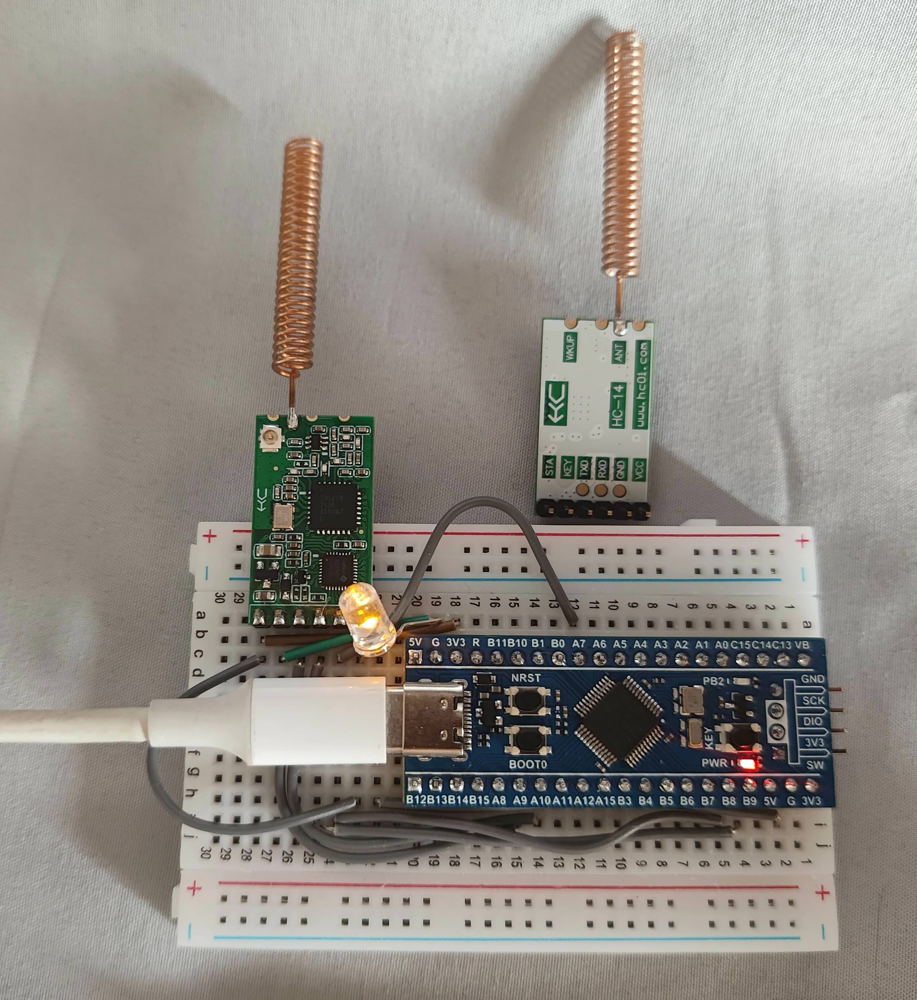

# hc14-at-rs 驱动

![No Std][no-std-badge]

**[[English]](./README.md)**

用于 hc-14 无线电收发器串行模块的驱动程序。

当 SET 引脚被拉低时，可以使用 AT 指令对该模块进行配置。该驱动程序从 `embedded-hal` 中获取输出引脚、串行端口和延迟时间，提供了一个与 hc14 模块交互的简便接口。

hc14 的运行状态：正常模式、AT配置配置。

更多详情，请参阅此处提供的[官方文档](https://www.hc01.com/downloads)，

在[barafael/hc12-at-rs](https://github.com/barafael/hc12-at-rs)基础上对hc14模块进行重构，不得不说，相比hc12，hc14模块被很多功能有没有了，文档对模块的介绍也就停留在介绍而已，例程也没有，我暂时只使用了STM32F103进行了测试，使用默认设置，在城市中，发送模块放在7楼的情况下，通信距离大约：600-700米的。

# 示例

```rust
let hc14 = Hc14::new(serial, key, delay).unwrap();

// 重置模式参数
let mut hc14_configure = hc14.into_configuration_mode().unwrap();
hc14_configure.reset_settings();

// 获取 Hc14 的参数
hc14_configure.get_parameters().unwrap();

// 设置信道
let mut buffer = [0u8; 32];
hc14_configure.wirte_set_channel(28, &mut buffer);

// 切换至普通模式
let mut hc14_normal = hc14_configure.into_normal_mode().unwrap();

// 发送缓冲区
let buf = b"hc14";
hc14_normal.send_buffer(buf).unwrap();

// 发送str
let buf_str = "hc14";
hc14_normal.send_string(buf_str);
```




<!-- Badges -->

[no-std-badge]: https://img.shields.io/badge/no__std-yes-blue